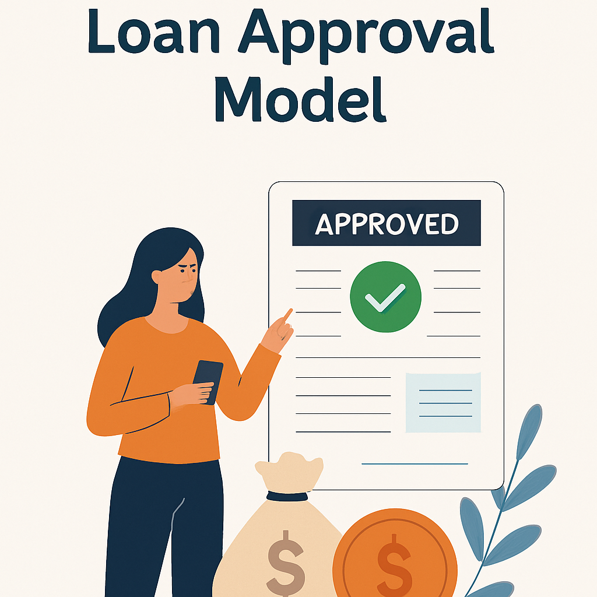

# 🏦 Loan Approval Classification System

**Author:** [Rupesh Garsondiya](https://github.com/Rupeshgarsondiya/Loan-Approval-Classification)  
**Organization:** L.J University  
**Deployment:** [Hugging Face Spaces 🚀](https://huggingface.co/spaces/YOUR_SPACE_LINK)  
**Web App Framework:** [Streamlit](https://streamlit.io)

---

## 📌 Overview

This project predicts whether a loan will be approved or not based on the applicant’s profile using machine learning. It provides a **complete pipeline from data analysis to model deployment**, wrapped in an interactive Streamlit web application.

---

## 📊 Features

- ✅ Comprehensive **Exploratory Data Analysis (EDA)**
- ✅ Visualizations (Bar Plot, Scatter Plot, QQ Plot for outliers)
- ✅ Preprocessing with `LabelEncoder`, `StandardScaler`, and `ColumnTransformer`
- ✅ Trained and saved multiple ML models (`Logistic Regression`, `Random Forest`, `KNN`, etc.)
- ✅ Custom model pipeline using **Pickle**
- ✅ Fully interactive **Streamlit web application** for inference
- ✅ **Deployed live on Hugging Face Spaces** for public access

---

## 🧠 Machine Learning Models

The project supports training and inference using the following models:

| Model               | Status     | Notes                                 |
|--------------------|------------|----------------------------------------|
| Logistic Regression| ✅ Trained | Fast, interpretable baseline           |
| Random Forest      | ✅ Trained | Handles non-linear relationships       |
| KNN                | ✅ Trained | Simple, lazy learner                   |
| Decision Tree      | ✅ Trained | Tree-based decision making             |
| Neural Network     | ✅ Trained | Keras-based deep model for performance |

---

## 🔬 EDA & Preprocessing

- **EDA**: Extensive analysis on data distribution, outliers, and feature correlations
- **Plots Used**:
  - Bar Plot (categorical analysis)
  - Scatter Plot (continuous feature interaction)
  - QQ Plot (detecting outliers)
- **Preprocessing Steps**:
  - Encoding categorical features using `LabelEncoder`
  - Scaling numerical features using `StandardScaler`
  - Using `ColumnTransformer` for combining preprocessing pipelines
- **Data split**: Train/Test split using stratified sampling

---

## 📦 Model Saving

Models and preprocessing pipelines are saved using:

- `pickle` for model serialization
- Organized versioning system in `/save_models/versionX/`
- `preprocessor.pkl` and `label_encoder.pkl` for inference

---

## 🌐 Web Application (Streamlit)

The application allows users to:

- Enter input features through a clean sidebar UI
- Choose the model to use for prediction
- View prediction probability
- See whether the loan is **Approved / Not Approved**
- Analyze training data statistics and model info

### 📸 UI Preview
> 

---

## 🚀 Deployment

- **Streamlit App** hosted on [Hugging Face Spaces](https://huggingface.co/spaces/YOUR_SPACE_LINK)
- Uses dynamic version loading for model management
- Compatible with both CPU and GPU environments

---

## 🛠️ How to Run Locally

```bash
# Clone the repo
git clone https://github.com/Rupeshgarsondiya/Loan-Approval-Classification.git
cd Loan-Approval-Classification

# Create and activate environment
python -m venv .env
source .env/bin/activate  # or .env\Scripts\activate on Windows

# Install requirements
pip install -r requirements.txt

# Run the Streamlit app
streamlit run app.py
